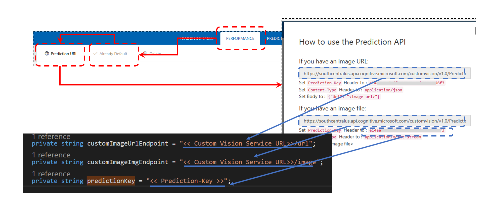

# Azure Cognitive Service - Custom Vison Service Client Sample  
[Azure Cognitive Service](https://azure.microsoft.com/ja-jp/services/cognitive-services/)の、カスタムな画像分析が可能な[Custom Vison Service](https://azure.microsoft.com/ja-jp/services/cognitive-services/custom-vision-service/)を利用するクライアントアプリのサンプルです。  

## Sample Apps  
- CustomVisonAccess  
.NET Standard Library上で動作する、Custom Vison Serviceへのアクセスクライアント
- SampleAppNETCore  
CustomVisonAccessライブラリを使って、Imageファイル、URLを分析するクライアントライブラリ。.NET Coreで動作  
-SampleAppUWP  
CustomVisonAccessライブラリを使って、Imageファイル、URLを分析するクライアントアプリ。Universal Windows Platform上で動作

## 準備  
[Custom Vision](https://www.customvision.ai/projects)で、各自の画像分析プロジェクトを構築します。  
※ 抽出したいモノ（Tag）二種類、Tag毎に5枚以上の写真があれば簡単に構築できます。   
TRAINING IMAGESにTagと画像を登録してトレーニングしてください。  
TRAININGが終わったら、SampleAppNETCoreのProgram.cs、SampleAppUWPのMainPage.xaml.csの二つのファイルの3つの変数  
- customImageUrlEndpoint  
- customImageImgEndpoint  
- predictionKey  
の値を、Custom Visonプロジェクトからコピーします。  

 

※ customImageUrlEndpoint、customImageImgEndpointの文字列にあらかじめ、/urlや/imageが記載されていますが、そこも含め上書きしてください。  

## 実行  
### SampleAppNETCore  
このサンプルを実行するには、[.NET Coreのインストール]()が必要です。
インストール後、Visual Studio Codeで、SampleAppNETCoreフォルダーを開きます。  .vs/launch.jsonを開き、
```json
{
    "version": "0.2.0",
    "configurations": [{
            "name": ".NET Core Launch (console)",
            "type": "coreclr",
            "request": "launch",
            "preLaunchTask": "build",
            "program": "${workspaceRoot}/bin/Debug/netcoreapp1.1/SampleAppNETCore.dll",
            "args": ["http://allmusic.galeon.com/caratulas/e/eric_clapton_-_the_cream_of_clapton-front.jpg"],
            "cwd": "${workspaceRoot}",
            "stopAtEntry": false,
            "console": "internalConsole"
        },
```
argsの[]内に分析したいURLや画像ファイルのパスを記述します。配列指定なので一気に複数の画像を処理可能です。URLとファイルパスが混在していても構いません。  
その後、デバッガーなどで実行してください。  

### SampleAppUWP  
このサンプルを実行するには、Windows 10、または、Windows 10 IoT Coreが動くデバイスが必要です。開発環境は、Windows 10 Creators Update以上を使ってください。  
Visual Studio 2017で、CustomVisonSamplesフォルダーのCustomVisionSamples.slnを開きます。ソリューションエクスプローラーで、SampleAppUWPプロジェクトをデバッグ実行してください。  
